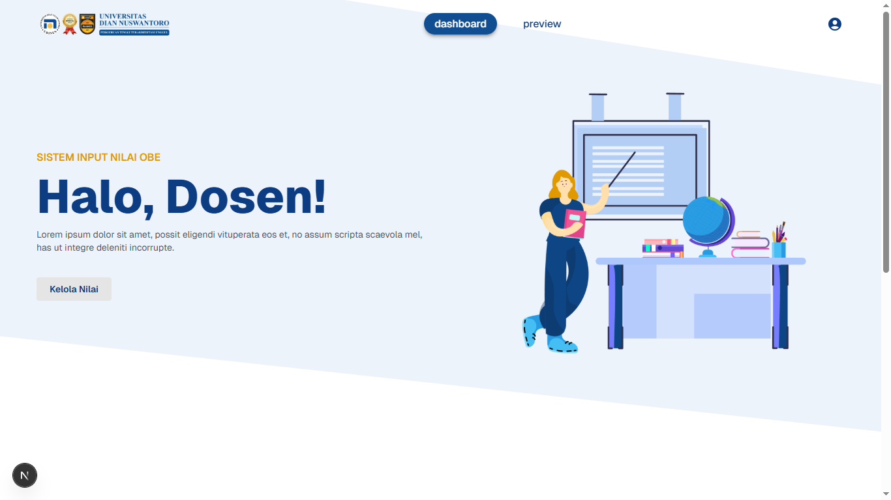
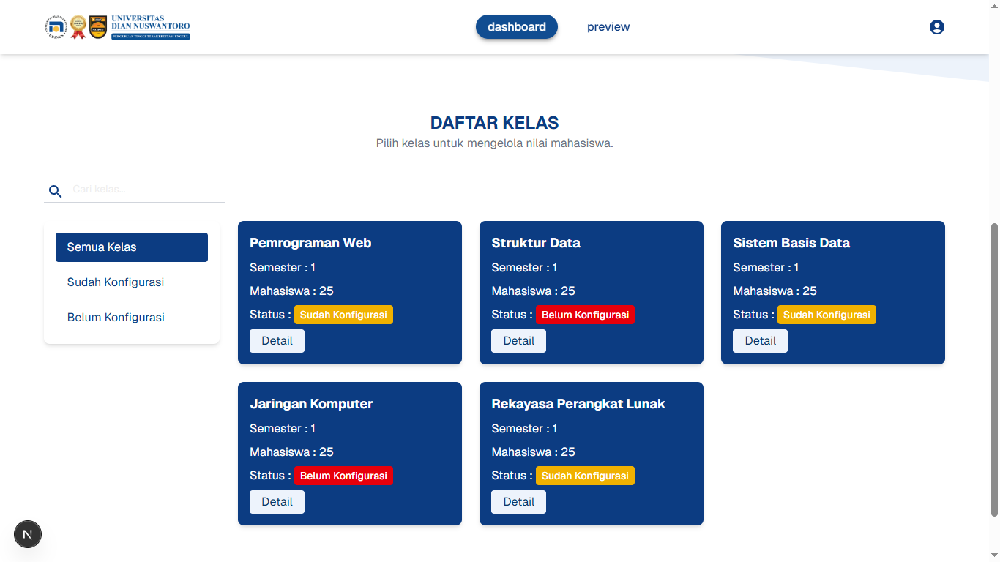
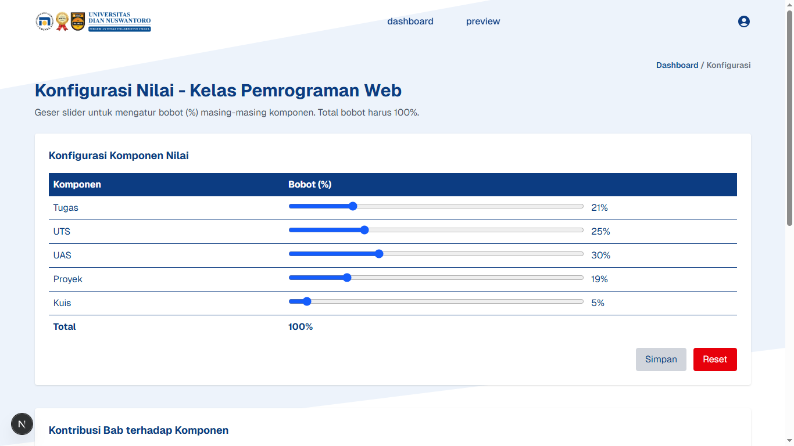
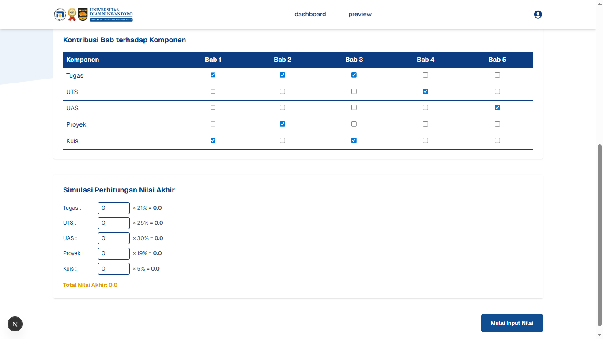
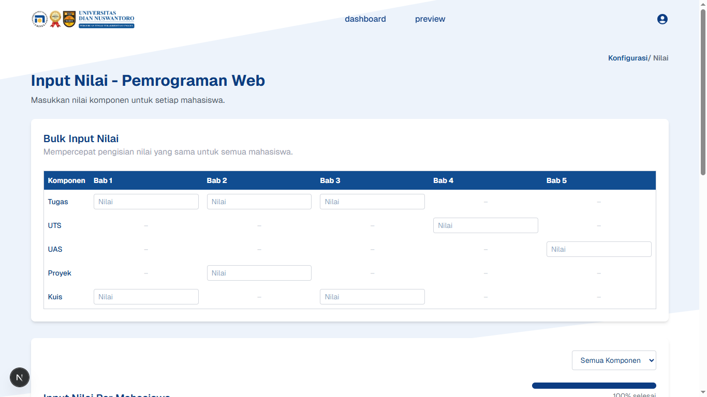
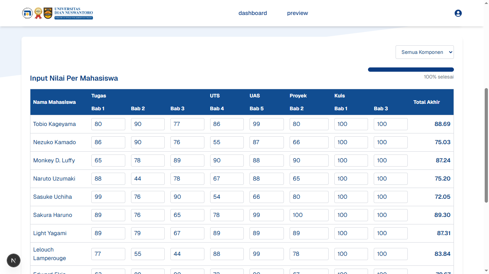
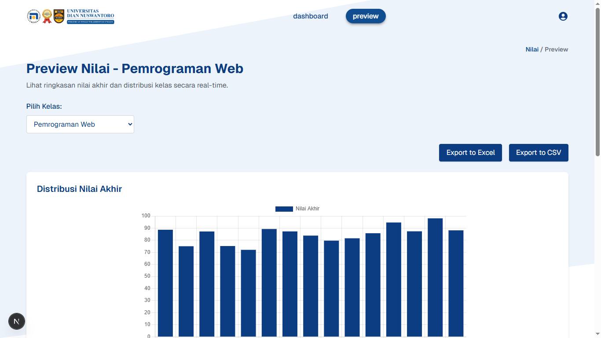
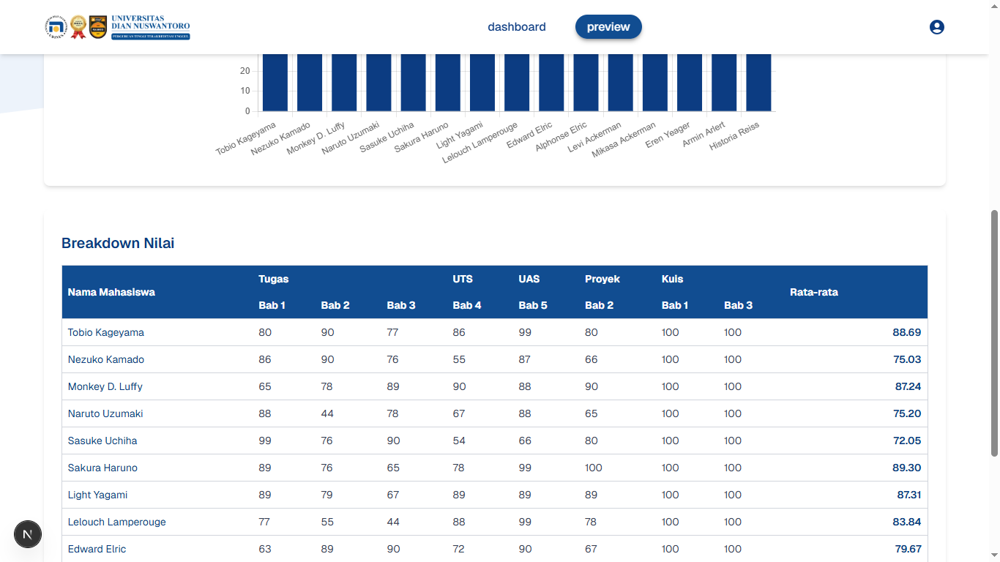

# 📚 Grade Management UI

A class dashboard application built with **Next.js**, **TypeScript**, **Tailwind CSS**, and **Material UI**. This app enables lecturers to configure course grading, input and manage student scores, and visualize performance summaries.

---

## 🚀 Tech Stack
- **Next.js** (App Router)
- **TypeScript**
- **Tailwind CSS**
- **Material UI**
- **Chart.js** – for visualizing grade distributions
- **React Hot Toast** – for user feedback
- **XLSX** & **FileSaver.js** – for exporting grades to Excel/CSV

## 📦 Installation
```bash
git clone https://github.com/nnyyrraa/grade-management-ui.git
cd grade-management-ui
npm install
```

## 🧪 Run Locally
```bash
npm run dev
Then open http://localhost:300 in your browser
```

## 📁 Project Structure
```bash
grade-management-ui/
├── src/
│   ├── app/                  # App router pages
│   ├── components/           # Reusable UI components
│   ├── lib/                  # Utilities and helpers
├── public/                   # Static assets
├── docs/                     # Screenshots and guides
├── package.json
├── tailwind.config.json
├── tsconfig.json
├── README.md                 # Setup instructions & overview
├── SOLUTION.md               # Design decisions & architecture
├── AI-COLLABORATION.md       # AI usage documentation
├── USER-GUIDE.md             # Application usage guide
```

## ✅ Core Features
- 🛠️ Grade component configuration
- 📊 Weighted score calculation based on components
- 🧮 Contribution per chapter selection
- ✍️ Real-time student score entry with auto-save
- 📈 Progress indicator for data completeness
- 🖼️ Grade preview with breakdown and visual chart
- ⬇️ Excel/CSV export with file name based on class

## 🔗 Live Demo
https://grade-management-ui.vercel.app
| Deployed on Vercel – Best viewed on desktop/laptop screen.

## ⚠️ Known Issues
- Saat halaman Preview dibuka sebelum input nilai dilakukan, beberapa perhitungan rata-rata masih menunjukkan 0.00. (Solusi: pastikan nilai dimasukkan dulu agar preview bekerja maksimal.)
- Belum mendukung import data mahasiswa melalui file CSV. Fitur ini bersifat optional (Priority 2).
- Tidak ada otentikasi pengguna karena fokus pada UI prototipe.

## 🖼️ UI Preview

### 📌 Dashboard Kelas
Menampilkan daftar kelas beserta status konfigurasi nilai.



---

### 📌 Konfigurasi Nilai
Pengaturan bobot komponen nilai dan kontribusi tiap bab.



---

### 📌 Input Nilai Mahasiswa
Tampilan input nilai per mahasiswa dan bulk input.



---

### 📌 Preview Nilai & Visualisasi
Ringkasan nilai akhir dan distribusi nilai dalam bentuk chart.


