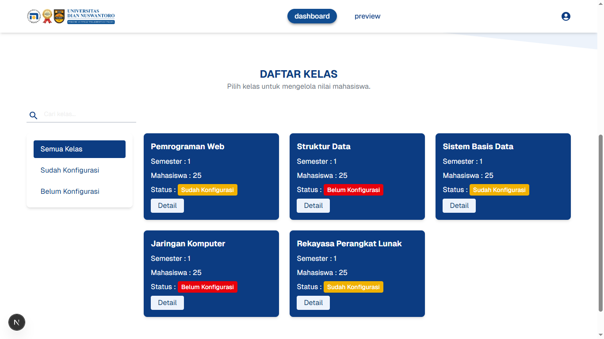
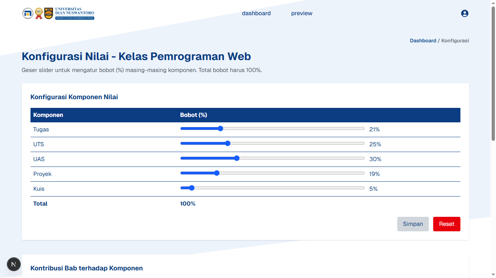
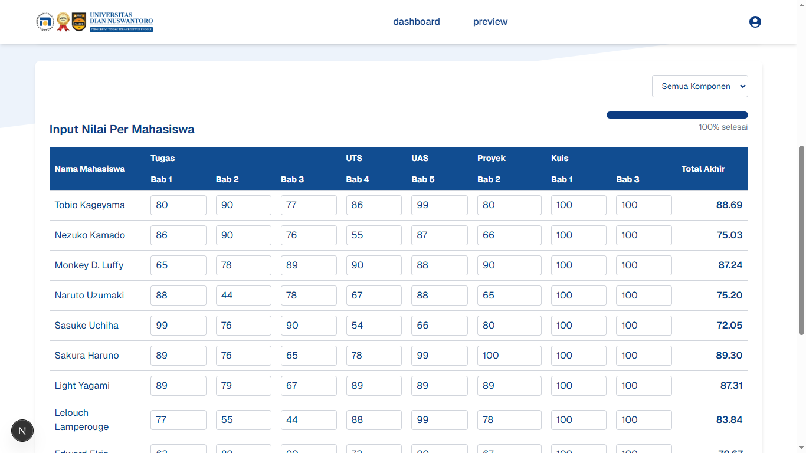

# USER-GUIDE.md

## 👋 Welcome to the Grade Management UI

A tool for lecturers to manage class grading components and student scores with ease.

---

## 📌 1. Dashboard

- View list of classes
- Check which classes have configured grading

---

## ⚙️ 2. Konfigurasi Nilai

- Set grading components (e.g., Tugas, UTS, UAS)
- Assign percentage weight to each
- Choose contributing chapters per component

> 💾 Click "Simpan Konfigurasi" to apply

---

## 📝 3. Input Nilai

- Input scores per component/chapter for each student
- Use **Bulk Input Nilai** to fill a value across all students
- Real-time auto-save to local storage
- See progress bar for completion

---

## 📊 4. Preview Nilai

- See grade breakdown per student
- Visualize final score distribution in bar chart
- Export as `.xlsx` or `.csv` file

> 📁 File will be named `DataMahasiswa_[NamaKelas]`

---

## 💡 Tips

- Ensure you have configured the class before inputting scores
- Use the dropdown to filter by component
- All configurations and data are saved per class
